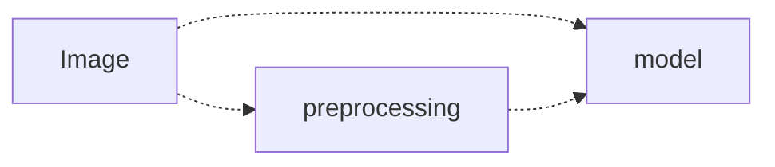
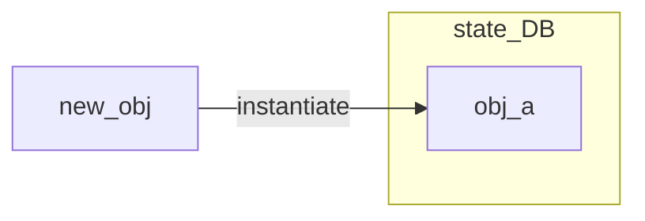

<!-- Sketching out the idea -->
## [Tennison - Introducing the "VEG-303" 🔗](https://www.instagram.com/p/CP9Z3Y3n9ZG/)

> Unfortunately, I con't figure out how to embed Instagram videos in this blog,
but I have made a drawing of the idea below.

I was inspired by a video that I saw on instagram by [Tennison](https://www.instagram.com/p/CP9Z3Y3n9ZG/) I saw on Instagram, which showed him pretending to create music by moving knobs and sliders made out of cut up vegetables on a cutting board - where each vegetable was cut up in the shape of a know, and they were all laid out on a chopping board in a make-believe electronic synthesizer / sequencer. The film was of him moving and turning the vegetable knobs or sliding them up and down, as if he was using them to controle the modulation of a moog synthesizer.

I thought it would be cool to actually do this, and use computer vision to detect the objects and use them as an interface for a music.

### Turning the AR / VR experience on its head

Having such a tactile feedback in AR / VR experiences is one of the problems that is hard to deal with - where the sensory experience of touching and pressing a physical object doesn't match up with the video overlay, and causes a disconnect.

I thought that this could be an interesting method of side stepping this problem- where you are completely interacting with a physical object - not the AR / VR representation of it.

An interaction like this sidesteps the problem of audience members only being able to interact a rendered version of the virtual space, and having to use a screen to interact with the virtual world.

**It brings AR into the real world, rather than bringing the real world into the AR.** The virtual world you are interacting with would still be a layer on top of the physical world, but you would be interacting with the physical world, and not a rendering if it. It allows your other senses (other than sight) to be the driver of the immagination, rather than your sight.

*After-all what is an AR/VR expeiernce?*; when you take part in an AR / VR experience, you are interacting with a digital representation of the world. The digital representation is a layer on top of the real world, and you are interacting with that layer.

### Using CV to implement this

could mean that you don't need special equipment for the objects (e.g. they don't need to be conductive, or have a special tag on them), although you would need to have a camera / phone to capture process the video feed.

The object could be anything, and you could use it to control anything.

# Technical description and breakdown

Take a live video capture of a scene, and be able to connect live transformation of objects into mapped signals. This can be broken down into three distinct parts (each of which can probably ben further broken down, but we will get to that):

- [Capture](#media-capture)
- [Recognition and understanding](#recognition)
- [Feedback](#Feedback)

## Media Capture

This is the preliminary step that captures the live video input and does any required preprocessing in order to get it into an ingestible format for the next stage - the model input.

## Recognition

The recognition section has several components to it. It mostly has to do with:
  - **finding new objects** in video feed, and associating it with a software controller
  - holding and updating the current **state** of known objects.
    - Hold state
    - recognise new state
  - understanging when an object has left the video feed, and remove it from the list of known objects and state.

Object detection, localization mapping the translation, rotation and 'touch' to variables

- observe the object as a new object
    a. make sure that the object isn't already in the list instantiated controller objects
    b. instantiate a new controller class for object
  - object centerpoint location or something similar could be used as inputs for the next iteration
  - differentiation submodel

### 1. Differentiate / segment / count objects

- instantiate objects
  - track and provide feedback hook.

## Reaction / feedbck

  - produce image overlay
  - produce sound

Exploring how to extract a mapping of an objects location, rotation and translation.

<!--
Questions / notes:

What is it?
- cv recognises an object, and captures its position and orientation
  - what is the object?

Talk about the idea from the video, and then list out concepts that found
interesting, and how I could use them as the basis for a project.

- use computer vision to track the position and orientation of an object
- use the position and orientation of the object to control a digital
  application

 -->

